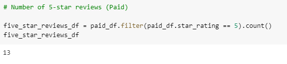

# **Amazon_Vine_Analysis**

## **Overview of Analysis**
The purpose of this analysis is to analyze Amazon reviews written by members of the paid Amazon Vine program. I will use Pyspark and Pandas to determine if there is any bias toward favorable reviews. 

## **Results**

**How many Vine reviews and non-Vine reviews were there?**

<ins>There were 22 Vine reviews.</ins>

<ins>There were 26,924 non-Vine reviews.</ins>

**How many Vine reviews were 5 stars? How many non-Vine reviews were 5 stars?**

There were 13 Vine reviews that were five stars.

Non-Vine five star reviews totaled 14,439.

**What percentage of Vine reviews were 5 stars? What percentage of non-Vine reviews were 5 stars?**

Approximately 59% of Vine reviews were 5 stars.

Approximately 54% of five star reviews were non-Vine reviews.

## **Summary**
It looks like there is no bias for reviews in the Vine program since the Vine reviews were significantly less than the non-Vine reviews. 

An additional analysis could be done to futher support this outcome. A comparison can be done of the total_votes.

